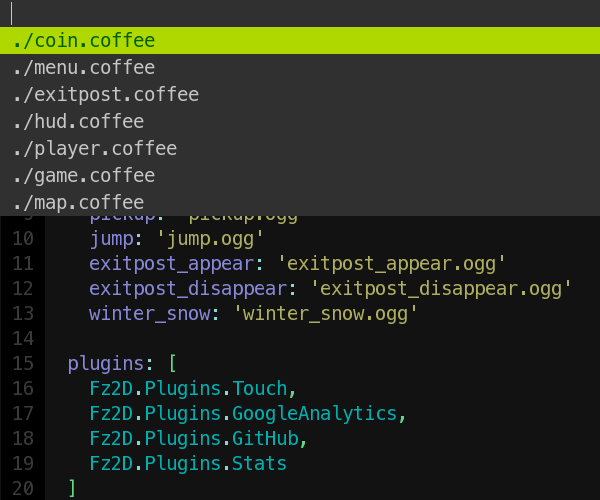

fastopen.vim
------------


```
map <c-l> :call fastopen#show('argedit')<cr>
```

Contribute
----------
* Fork the project.
* Make your feature addition or bug fix.
* Do **not** bump the version number.
* Send me a pull request. Bonus points for topic branches.

License
-------
Copyright (c) Mihail Szabolcs. Distributed under the same terms as Vim itself. See
:help license.
